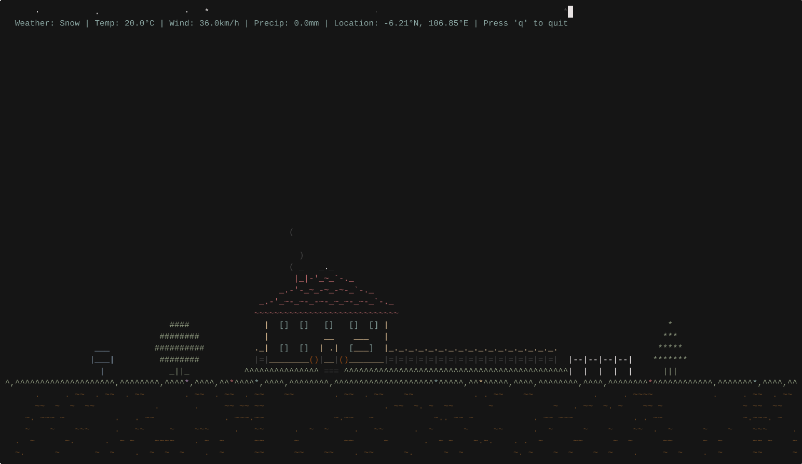

<br/>
<div align="center">
  <h1 align="center">🌤️ weather</h1>
  <p align="center">
    <strong>A terminal weather app with ASCII animations driven by real-time weather data.</strong>
  </p>
  <p align="center">
    <a href="https://github.com/toxicbishop/weather/commits/main">
      
    </a>
    <a href="https://github.com/toxicbishop/weather/blob/main/LICENSE">
      
    </a>
  </p>
</div>

<br/>

## About The Project

**weather** is an aesthetically pleasing, terminal-based application that brings you the weather in a uniquely visual way. Driven by real-time data from Open-Meteo, it renders immersive ASCII animations of current weather conditions right in your command line.

Experience rain drops falling across your terminal, lightning strikes on a stormy night, or calm clear skies with a sun and birds perfectly rendered in ASCII art.

<div align="center">

|                                    Thunderstorm Night                                     |                             Snow                              |
| :---------------------------------------------------------------------------------------: | :-----------------------------------------------------------: |
|  |  |

</div>

### ✨ Key Features Let It Shine

- **Real-Time Accuracy:** Powered by Open-Meteo for precise meteorological data.
- **Dynamic ASCII Animations:** Supports rain, snow, thunderstorms, clouds, day/night cycles, and flying airplanes.
- **Auto-Location:** Automatically fetch the weather for your current IP address without any setup.
- **Highly Customizable:** Adjust units (metric/imperial), hide standard readouts, toggle UI elements.
- **Aesthetic Terminal UI:** Clean, minimalist standard readout paired with bold ASCII visuals.

---

## Getting Started

To get a local copy up and running, follow these simple steps.

### Prerequisites

You will need the Rust package manager (`cargo`) installed. If you don't have it, get it from [rustup.rs](https://rustup.rs/).

### Installation

Clone the repository and install it using Cargo:

```bash
# 1. Clone the repo
git clone https://github.com/toxicbishop/weather.git

# 2. Navigate into the directory
cd weather

# 3. Build and install via Cargo
cargo install --path .
```

*Other Platforms:*
- **Windows Winget:** `winget install -i Veirt.weather`
- **Arch Linux:** `yay -S weather`
- **macOS:** `brew install Veirt/veirt/weather`

---

## Configuration

`weather` runs flawlessly out of the box, but can be highly tailored via a `config.toml` file.

**File Location:**
- **Windows:** `~/AppData/Roaming/weather/config.toml`
- **Linux:** `~/.config/weather/config.toml` 
- **macOS:** `~/Library/Application Support/weather/config.toml`

**Example Configuration:**

```toml
# weather/config.toml

# Hide the HUD (Heads Up Display) with weather details
hide_hud = false

# Run silently without startup messages
silent = false

[location]
# Location coordinates (overridden if auto = true)
latitude = 40.7128
longitude = -74.0060

# Auto-detect location via IP
auto = true

# Hide the location name in the UI
hide = false

[units]
# Units: "celsius" | "fahrenheit"
temperature = "celsius"
# Units: "kmh" | "ms" | "mph" | "kn"
wind_speed = "kmh"
# Units: "mm" | "inch"
precipitation = "mm"
```

---

## Usage 

Run the app normally to see the live weather for your area:
```bash
weather
```

> **Note:** weather requires a terminal size of at least `70x20` characters to display its ASCII layouts correctly.

### Keyboard Controls
- **`q`** or **`Q`**: Quit the application
- **`Ctrl+C`**: Force Exit

### Command Line Overrides
You can easily override your config values for a single run using CLI flags:

```bash
# Force metric or imperial units
weather --metric
weather --imperial

# UI adjustments
weather --hide-hud
weather --hide-location

# Simulate conditions (Great for testing!)
weather --simulate rain
weather --simulate snow --night
# Simulate UFO (Shows up on clear night)
weather --simulate clear --night
```

*Available Simulation States: `clear`, `partly-cloudy`, `cloudy`, `overcast`, `fog`, `drizzle`, `rain`, `freezing-rain`, `rain-showers`, `snow`, `snow-grains`, `snow-showers`, `thunderstorm`, `thunderstorm-hail`*

---

## 📝 Roadmap

- [ ] Support for adding multiple API keys (OpenWeatherMap, WeatherAPI, etc.)
- [x] Initial release features & auto-location API structure
- [ ] Implement keybindings to pause/speed up animations interactively.

---

## 📜 License & Credits

Distributed under the **GPL-3.0-or-later** License. See [`LICENSE`](LICENSE) for more information.

- **Data source:** [Open-Meteo](https://open-meteo.com/) (CC BY 4.0 license)
- **ASCII Art:** Adapted from original artists at [asciiart.eu](https://www.asciiart.eu/) (including Joan G. Stark, Hayley Jane Wakenshaw, and others). 
